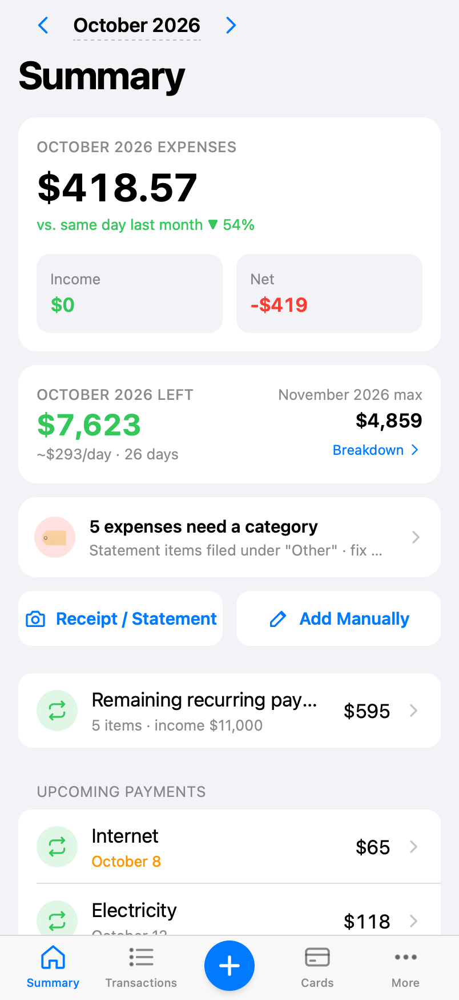
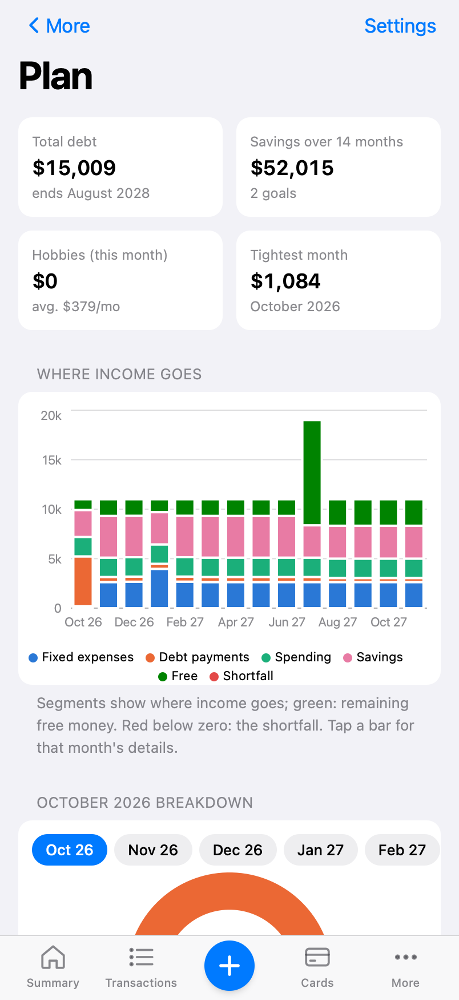
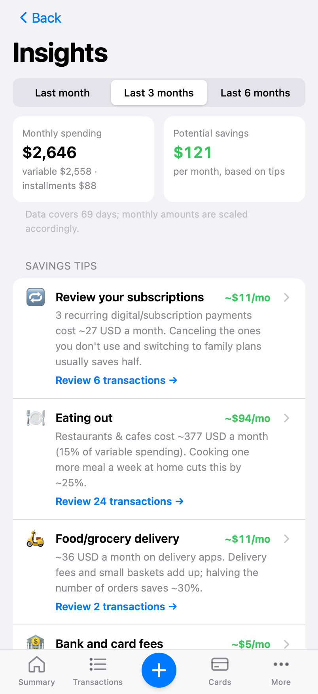

<p align="center"></p>

<h1 align="center">Budget Tracker for Home Assistant</h1>

<p align="center">
A private household budget tracker that runs as a Home Assistant add-on.<br>
Receipts and card statements are read by a <b>local</b> AI model — your financial data never leaves your home.
</p>

<p align="center">
<a href="https://my.home-assistant.io/redirect/supervisor_add_addon_repository/?repository_url=https%3A%2F%2Fgithub.com%2Fmmucahitkaya%2Fbudget_tracker"></a>
</p>

<p align="center"><a href="https://mmucahitkaya.github.io/budget_tracker/">Website</a> · <a href="budget_tracker/DOCS.md">Documentation</a> · <a href="https://github.com/mmucahitkaya/budget_tracker/issues">Issues</a></p>

<p align="center">



</p>

## Features

- **Receipts & statements** — photos, screenshots or PDFs. Text PDFs are parsed line by line (US `1,234.56` and European `1.234,56` formats, installment notations) and reconciled to the statement total; images go to a vision model running in [Ollama](https://ollama.com) on your network.
- **Credit cards & installments** — balances, statements, due-date reminders, partial payments. Installment purchases appear month by month and are never duplicated across statements.
- **Recurring income & bills** — salaries on the last business day, loans with varying amounts, one-off payments, raise reminders.
- **What can we spend?** — "this month left" and "next month at most", counting card payments when they are due.
- **14-month plan** — income, fixed costs, debt payments, spending and savings goals with running balance and payoff charts.
- **Savings insights** — biggest categories and merchants, subscriptions, frequent small purchases, tips with estimated savings; tap to review transactions.
- **Fast categorization** — uncategorized spending grouped by merchant, marketplace orders kept separate, notes for what you bought; merchants are learned.
- **Budgets, reports, history & undo**, **investments** (stocks, funds, metals, cash) linked to **savings goals**.
- **Telegram bot** (optional) — log "coffee 4.50" or send a receipt photo; weekly summaries and statement reminders.
- **Any currency** — choose a base currency at setup; other currencies are converted with daily ECB rates. Optional regional extras (e.g. Turkey: TCMB rates, Borsa Istanbul, gold coins).
- **Two-person households** — each Home Assistant user signs in as themselves; things can be personal or shared.

## Installation

1. In Home Assistant go to **Settings → Add-ons → Add-on store → ⋮ → Repositories** and add
   `https://github.com/mmucahitkaya/budget_tracker` (or use the button above).
2. Install **Budget Tracker**, start it and enable **Show in sidebar**.
3. Open the panel and answer the first-run setup questions (currency, number format, extras).
4. *(Optional)* Document reading: install Ollama on a computer on your network, run
   `ollama pull qwen3-vl:8b-instruct`, start it with `OLLAMA_HOST=0.0.0.0` and set **Ollama URL** in the add-on options.

See [DOCS.md](budget_tracker/DOCS.md) for all options, the Telegram bot and notifications.

## Privacy

- Data is stored in SQLite inside the add-on (`/data`) and included in Home Assistant backups.
- No cloud AI. The only outbound requests are exchange rates, investment prices and (if enabled) Telegram.
- Access is limited to the Home Assistant users you choose.

## Development

```bash
# Backend
python3 -m venv .venv && .venv/bin/pip install -r budget_tracker/requirements.txt pytest
.venv/bin/python -m pytest tests

# Frontend
cd budget_tracker/frontend && npm install && npm test && npm run build

# Run locally (no Home Assistant needed)
cd budget_tracker && BUDGET_DATA_DIR=/tmp/budget BUDGET_DEV_USER=dev:Dev \
  ../.venv/bin/uvicorn app.main:app --port 8099
```

Project layout:

```
repository.yaml          Home Assistant add-on repository
budget_tracker/          the add-on (config, Dockerfile, FastAPI app, React frontend)
tests/                   backend tests (pytest)
docs/                    website (GitHub Pages)
scripts/                 helpers (Ollama launch agent, document parsing playground, screenshots)
```

## License

[MIT](LICENSE)
